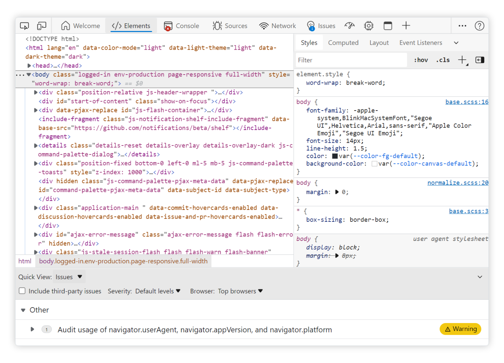

# Microsoft Edge DevTools

**Welcome to the Microsoft Edge DevTools feedback repository.**

This is a place for all users of DevTools to send ideas, feedback, suggestions, bugs, but also ask questions and have discussions about DevTools.

* 📢 [Open a new issue](https://github.com/MicrosoftEdge/DevTools/issues/new/choose).
* 🔎 [Search for existing issues](https://github.com/MicrosoftEdge/DevTools/issues).
* 📗 [Learn how to use Microsoft Edge DevTools](https://docs.microsoft.com/microsoft-edge/devtools-guide-chromium/).
* 💾 [Download Microsoft Edge](https://www.microsoft.com/edge).

  

## Code of conduct

Note that this project has adopted the [Microsoft Open Source Code of Conduct](https://opensource.microsoft.com/codeofconduct/).
For more information see the [Code of Conduct FAQ](https://opensource.microsoft.com/codeofconduct/faq/) or
contact [opencode@microsoft.com](mailto:opencode@microsoft.com) with any additional questions or comments.

## Trademarks

This project may contain trademarks or logos for projects, products, or services. Authorized use of Microsoft 
trademarks or logos is subject to and must follow 
[Microsoft's Trademark & Brand Guidelines](https://www.microsoft.com/legal/intellectualproperty/trademarks/usage/general).
Use of Microsoft trademarks or logos in modified versions of this project must not cause confusion or imply Microsoft sponsorship.
Any use of third-party trademarks or logos are subject to those third-party's policies.
