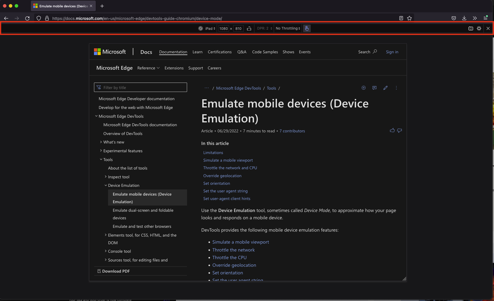

# DevTools: In-browser responsive design and emulation tools

Authors:
 - *[Chris Heilmann](https://github.com/codepo8)*, Microsoft Edge, PM

## Status of this feature

This is a proposal for a new feature that is not yet in development.

## Proposal

Responsive design tooling and device emulation should be available in main browser window without the DevTools being open.

### Introduction

The current implementation of [device emulation and responsive design tooling](https://docs.microsoft.com/microsoft-edge/devtools-guide-chromium/device-mode/) requires DevTools to be open. This means that single screen users will have not much space in the browser to emulate high resolution devices without having to zoom out. 

Multi screen users can dock the developer tools to another screen, but will have a disconnect between using the elements picker and seeing the result on a different screen.

The original tooling idea was to see an emulated device or resize the viewport and use the tools to debug and edit the product. This assumes that every user of this functionality will be a developer who works on the project. There is, however, a much larger group of designers, testers and power users who would benefit from being able to spot check products in different resolutions and emulated devices without having DevTools open as they are just wasted screen estate for them.

### Goals

Enable all users to 

* see the current web product in different resolutions
* see the product in various emulated devices
* see the product in different media states (dark mode, light mode, high contrast)
* see the product in various emulated vision states (colour deficiency, blurred)

### Existing implementations

The [Microsoft Edge Extension for Visual Studio Code](https://aka.ms/devtools-for-code) currently features [a screencast with an own toolbar](https://docs.microsoft.com/microsoft-edge/visual-studio-code/microsoft-edge-devtools-extension#device-and-state-emulation) that offers similar functionality.

Firefox also has an emulation bar that is available independent of Developer tools being open.

## Discussion points

The main question to answer now is one of discovery. How would users not familiar or interested in Developer Tools be able to find this functionality?

## Feedback
Have feedback? We want to hear it! *[Issue #83](https://github.com/MicrosoftEdge/DevTools/issues/83)* tracks community feedback on this explainer.