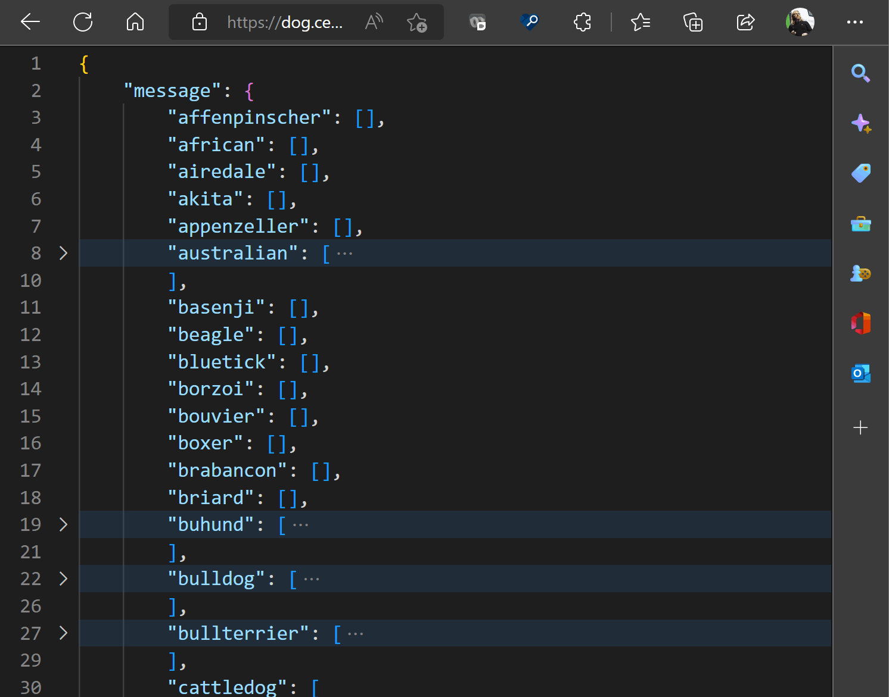

# DevTools: In-browser JSON viewer

Authors:
 - *[Chris Heilmann](https://twitter.com/codepo8)*, PM, Microsoft Edge

## Status of this feature

This is a proposal for a new feature that is not yet in development.

## Proposal

Currently when you navigate to a JSON file in Microsoft Edge, you get a basic text display of the document.

When navigating to an HTML document, and selecting "view source" you get a colour-coded display with line numbers instead.

We propose to replace tha basic JSON view with a colour-coded, collapsible and expandable one.

We are currently investigating the overall browser performance impact of this, which is why the first implementation will be basic.

### Goals 

As JSON files are data structures and users want to drill down into the data and analyse it in detail. This is a first step in this direction. In subsequent iterations we want to add more functionality like displaying header data and a raw view, saving and copying data and filtering the information.

### Usage 

This functionality will trigger automatically when the browser navigates to a JSON file on the web or the user opens a local one.

## Feedback
Have feedback? We want to hear it! *[Issue #87](https://github.com/MicrosoftEdge/DevTools/issues/87)* tracks community feedback on this explainer.