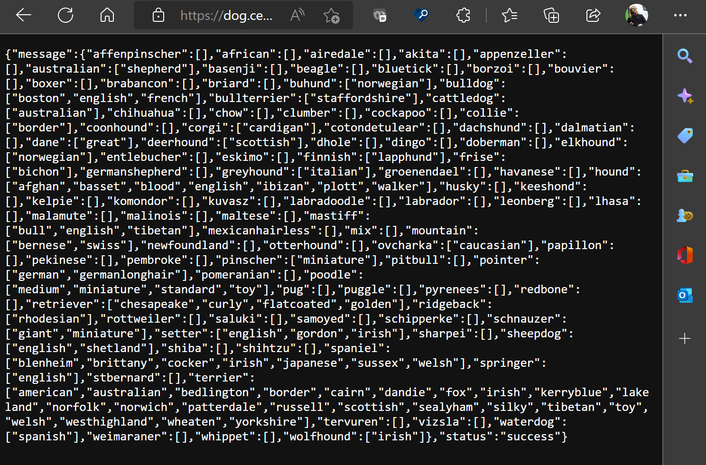
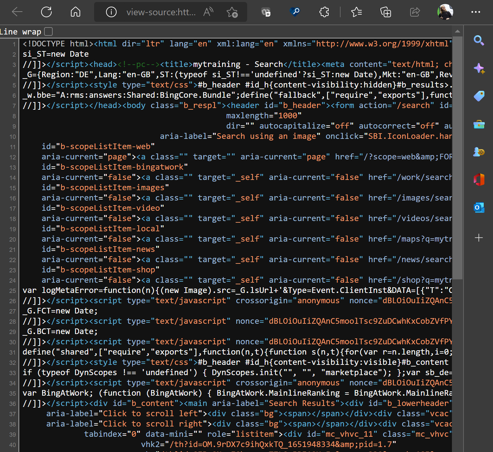
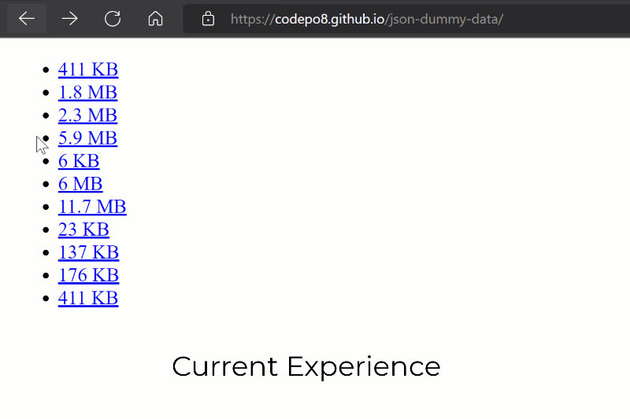

# DevTools: In-browser JSON viewer

Authors:
 - *[Chris Heilmann](https://twitter.com/codepo8)*, PM, Microsoft Edge

## Status of this feature

This is a proposal for a new feature that is not yet in development.

## Proposal

Currently when you navigate to a JSON file in Microsoft Edge, you get a basic text display of the document.

When navigating to an HTML document, and selecting "view source" you get a colour-coded display with line numbers instead.

We propose to replace that basic JSON view with a colour-coded, collapsible and expandable one.

We are currently investigating the overall browser performance impact of this, which is why the first implementation is what is shown in the screencast above.

### Goals 

As JSON files are data structures and users want to drill down into the data and analyse it in detail. This is a first step in this direction. In subsequent iterations we want to add more functionality like displaying header data and a raw view, saving and copying data and filtering the information.

### Usage 

This functionality will trigger automatically when the browser navigates to a JSON file on the web or the user opens a local one. Once we add more features you will also be able to interact with the JSON data in more detail.

### Feature release plan

**Current:** JSON is being displayed as a collapsible tree with line numbers and colour coding in dark and light themes

Upcoming features in delivery order: 

* Get a "slow" warning when the JSON is too big to render and an option to show it as plain text instead
* Get an "invalid" warning when the JSON payload is invalid
* Switch between the expandable tree view and the raw text view
* Copy the JSON payload with a button
* Download the JSON payload with a button
* Search/filter the JSON
* Expand and collapse all the nodes in the document
* Choose to display JSON in table format for array data that can be sorted/filtered
* Large JSON payloads will load the first 500K and then offer to stream the rest
* Choose to inherit themes from DevTools
* Set Raw or Tree display as a default
*  Open JSON in Network Console

## Feedback
Have feedback? We want to hear it! *[Issue #87](https://github.com/MicrosoftEdge/DevTools/issues/87)* tracks community feedback on this explainer.
