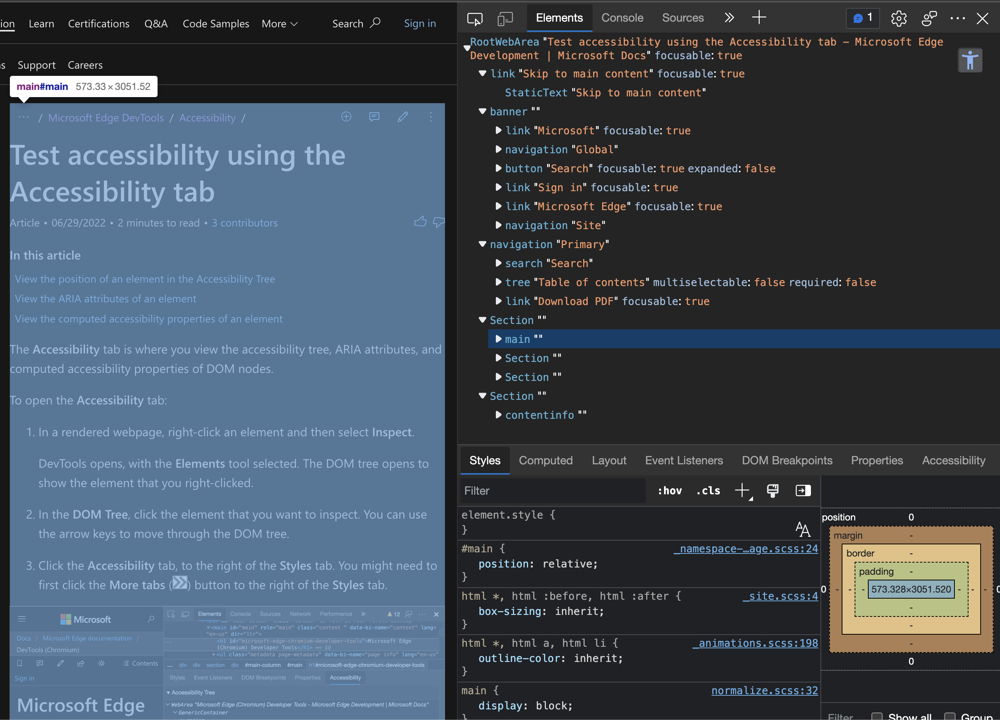
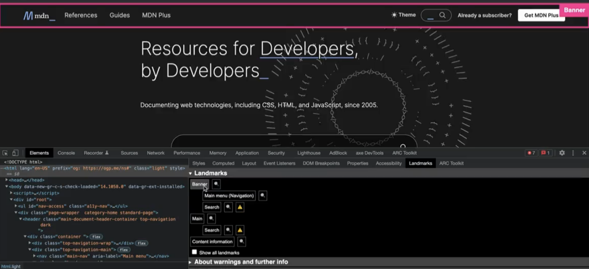
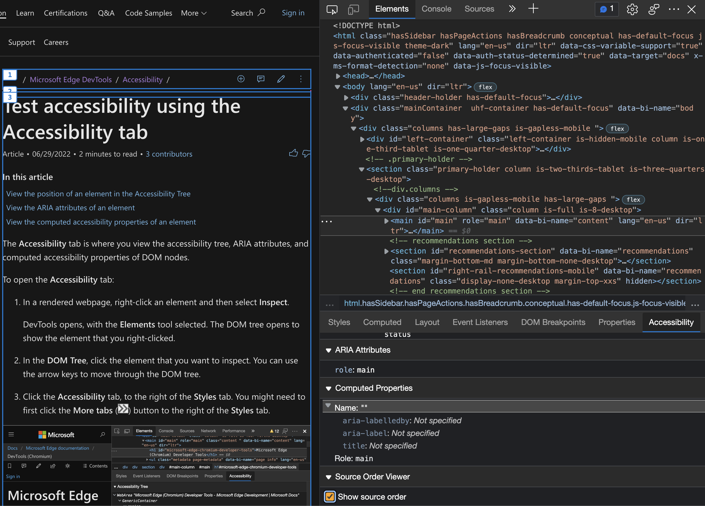

# DevTools: Landmarks tree view with page overlays

Authors:
 - *[Chris Heilmann](https://github.com/codepo8)*, Microsoft Edge, Program Manager

Landmarks are an important accessibility feature of any web product as they allow users of assistive technology to navigate them quickly without a lot less noise and interaction. Currently there is no way to see in a visual manner what part of the document constitutes a landmark.

## Status of this feature

This is a proposal for a new feature that is not yet in development.

## Proposal

Currently the only way to verify the existence of landmarks is via manual testing or by checking the  [Accessibility tree](https://docs.microsoft.com/en-us/microsoft-edge/devtools-guide-chromium/accessibility/accessibility-tab).

There is also an experimental, full accessibility tree view in the Elements tool.

Both these tools do not offer a visual overlay showing the user what part of the document is the landmark. You also need to know what constitutes a landmark.

Therefore having a landmark tree with page overlays would be useful for spot checking accessibility. There are already Developer Tools extensions like the [Landmarks browser extension](http://matatk.agrip.org.uk/landmarks/) that offers this functionality. You can see the extension in action [watching this video](https://user-images.githubusercontent.com/13508/168231108-6c39335a-eb19-4e9f-be04-5fb35ea208ff.mp4) or in the following screenshot.

Currently the Accessibility tool already features a [Source Order Viewer](https://docs.microsoft.com/microsoft-edge/devtools-guide-chromium/accessibility/test-tab-key-source-order-viewer), that applies overlays to the document.

This proposal is to offer an own landmarks tree with similar overlays in the Accessibility tool and show overlays in the current document in the Accessibility tree. Furthermore, the full accessibility tree display should highlight landmarks in a more obvious manner.

### Goals

1. Give web content authors a simple way to verify that their landmarks syntax is correct.
1. Allow testers to verify the existence of landmarks in a web product in a fast and visual way.

## Feedback
Have feedback? We want to hear it! *[Issue #56](https://github.com/MicrosoftEdge/DevTools/issues/56)* tracks community feedback on this explainer.