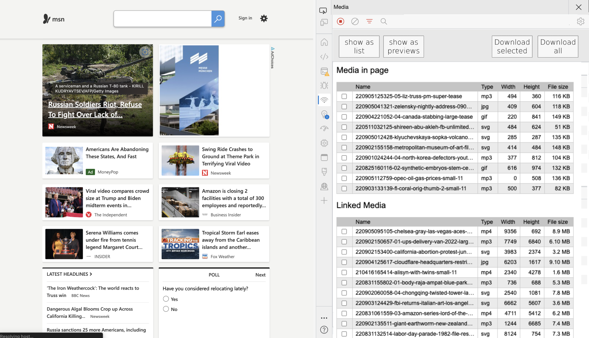
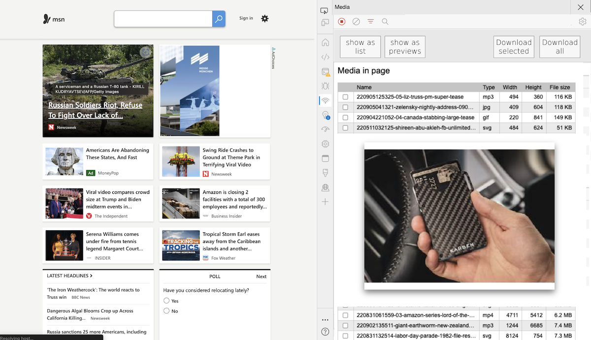
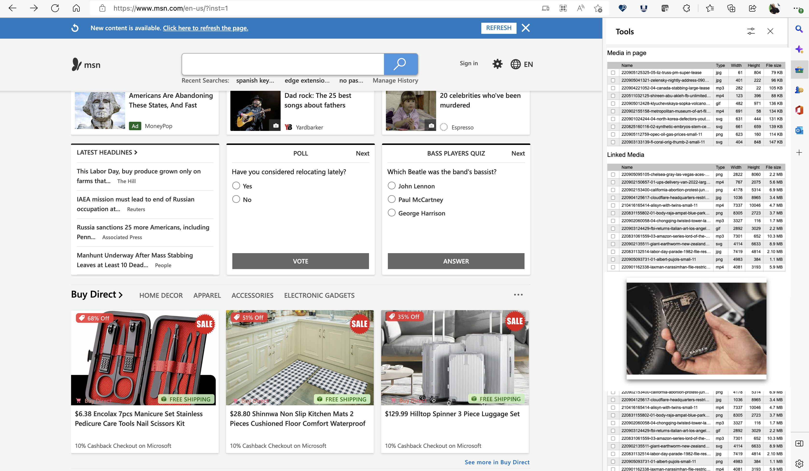

# DevTools: Media Explorer

Authors:
 - *[Chris Heilmann](https://github.com/codepo8)*, PM, Microsoft Edge

## Status of this feature

This is a proposal for a new feature that is not yet in development.

## Proposal

A common use case of the web is to download images and videos displayed in web products, either to consume offline or to re-use and share. Often this media is hard to get as web products don't make it easy to access it or only show a low quality preview and link to the full version. The media explorer tool would cut to the chase and display all the images and video sources in the current document as an easy to navigate, preview and download interface.

### Introduction

There are numerous browser extensions and software packages that allow you to do grab and download media from web pages. Many come with a subscription and as this is a common demand there is also a fair share of malware in this area. As the media of any web site is already downloaded to the user's browser cache and DevTools can analyse the product's source for links to media this feature would make extensions like these obsolete and offer a safer option for users.

All the functionality of the media explorer is available using existing tools in DevTools, but it needs developer skills to use them.

* The Network Tool allows you to access and download media in the current document.
* The Elements and Console tool to analyse the structure of a document and get a list of all the media in the current document and links to more.

The media explorer tool makes this easier for users not familiar with the Network tool or how web sites are structured.

### Goals

The media explorer helps users to:

* Find, explore and download media in the current web site
* Get access to the full size media on web sites with preview images
* Consume videos in a native browser interface instead of players with annoying overlays and interstitials
* Users on slower and flaky connections to try to download media instead of getting a buffering or time out experience

### Usage 

When opening DevTools on a document, the user can switch to the media explorer to see links to all the videos and images in the current document. 

Clicking any of these will open a preview of the media with information about size and availability. 

Users can download individual files or select more than one and get a zip file of all of them. 

Alternatively, the Media Explorer could also be used as part of the side bar experience without any need to open developer tools.

## Feedback

Have feedback? We want to hear it!

