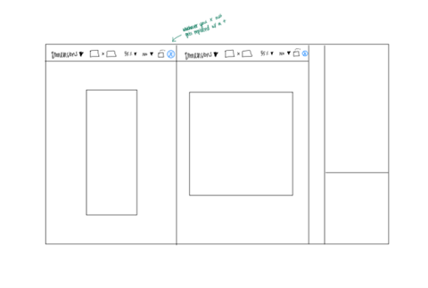
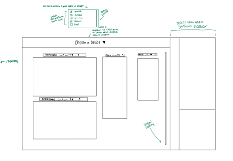

# DevTools: Multiple viewports in Device Mode

## Authors

- [Evelyn Chou](https://github.com/evelynchou02), Explorer Intern
- [Hana Memon](https://github.com/hanamemon), Explorer Intern
- [Jenna Sasson](https://github.com/jenna-sasson), Explorer Intern

## Status of this feature

This feature is experimental and in active development. See [Changelog section](#changelog) for details on progressive feature implementation.

## Introduction

### Current Device Mode

The history of the Device Mode feature in DevTools predates the current, diverse device ecosystem and mobile emulation has only grown in scope and complexity. Device Mode is a popular tool that web developers use to test the responsiveness of their web contents. Currently, Device Mode allows you to view the webpage through the dimensions of a single device. In this explainer, we propose that handling one device is not enough. There is currently no solution to seeing multiple viewports simultaneously in the DevTools. The only solution is to use browser extensions/external tools.

### User Jobs-To-Be-Done (JTBD)

- Find visual errors on a website in multiple layouts and sizes.
- Test for functionality of the buttons and scrolling on the website.
- Ensure the visual and functional aspects of the website are correct on different devices.
- Compile a list of necessary bugs and changes to be fixed.

### Solution

- Allow users working in Device Mode to be able to add multiple viewports for different devices at one time. Using the WebContents class, users will be able to add extra devices using Headless Mode. Users will be able to see multiple sizes (and different devices that use different operating systems, e.g., iPhone 11 & Galaxy Tab A7) side by side in DevTools. By adding multiple viewports, users can use Device Mode in a more streamlined way without negatively affecting the current experience.
- Users will be more easily able to complete their JTBD if they can see multiple devices at once. They will make comparisons of the functionality and visual aspects of websites in multiple sizes more quickly, increasing overall productivity.
  
## Competitive Research

Already existing tools on the market include:

- [Polypane](https://polypane.app/)
- [Sizzy](http://sizzy.co/)
- [Responsively](https://responsively.app/)
- [Blisk](https://blisk.io/)

Each of these applications allow users to add multiple (more than 2) devices through their external application/extension. All these applications allow for synchronization when scrolling and have a multitude of device options (which did not account for newer devices). Some apps became glitchy with too many viewports/devices selected.

## Goals

1. Primary goals include increasing the number of users who enable DeviceMode and increase number of users who test more than 1 device.
1. Improve satisfaction and efficiency in designing a website through easy access to and visibility of multiple viewports.
1. Metrics to measure success:
    1. Session length with DeviceMode enabled (1D v 2D v 10D user).
    1. Number of users who enable DeviceMode.
    1. Proportion of device mode users who use 2+ viewports compared to all total device mode users in the 1st place

## Non-goals

- This feature will not change the default experience of the current Device Mode in DevTools. This feature will be additive/optional.
- For the initial implementation of this feature, we will only support 2 viewports, but we are designing the feature to scale up to N viewports in the future.

## Hypotheses

- We believe that using DeviceMode with multiple viewports will increase efficiency in DevTools customers. Additionally, it will increase user engagement either in session length or number of sessions. Web Developers can be more efficient using DeviceMode if they can view their web pages in multiple screen sizes, dimensions, and device forms side-by-side in DevTools while they make changes as this avoids having to manually resize the viewport. 
- The current single viewport device mode has valuable screen real estate that is being underutilized and we think that we can bring in new functionality by adding multiple viewports without negatively changing the experience and functionality today. As of right now, multiple viewports are available but only when using extensions or multiple tools. Adding multiple viewports directly into DevTools will streamline the user experience.

## Experimentation

We know this feature will be shipped as an experiment in the Microsoft Edge DevTools.

### Trigger Conditions and Treatment

- Opening Device Mode.
- Showing the option within the dropdown menu to add a new viewport.

### Metrics

- Through this experiment, session times will be analyzed.
- Additionally, (for the treatment group) this experiment will provide further insight into how many screens are needed by users to be productive. This can be tracked by checking how many screens are activated in each working session.

## Usage

### Add a new viewport

Users will be able to add a new device to the viewport by simply checking a box from the dropdown list of devices in the viewport toolbar. Once a device is added, it will appear either next to or underneath the existing viewport(s) with a toolbar on top of it. The devices will be re-centered to accommodate the new viewport. As more devices are added and the viewport fills up, the user will be able to vertically scroll down the viewport to look at all the devices.

### Open DevTools against a new viewport

DevTools will remain the same, regardless of the number of devices in the viewport. As in the current version of DevTools the user will be able to choose the placement of DevTools on their screen and expand/shrink the DevTools window.

### Synchronize browsing and inspection across viewports

Browsing will be synchronized across devices in the viewport, meaning that scrolling in one device would mean all other devices would be kept in sync so they are displaying as close to the same content as possible.. The same will also be true for inspecting and selecting items across different devices in the viewport.

## Design

We have two designs: one for the feature as a whole and one for our intern project implementation. While the implementation of our project will start with only adding a second device, the design we created is scalable to allow for a larger number of devices all in one viewport. The first design adds an entirely new viewport (almost like a new tab) for a second device, which while it works well for two devices, would not be manageable for a larger scope. The second design takes this into account and adds multiple devices into a grid formation in one viewport so users can more easily view a greater number of devices.

Link to design for our project implementation (scoped for two viewports): 

### Open Questions and Ideas

- Zoom percentage (synchronized across devices?).
- The user’s device is smaller than the screen they want to test (what would the default be?).
- How many screens does user want to see all at once before they need to scroll (default vs user customization).
- How would this be affected by placement of sidebar.

<!-- ## Sizing the Business Opportunity

Given that Device Mode is the second most used feature in DevTools users, such as professional developers and website testers, will continue to rely on Edge DevTools to streamline their processes. This feature will drive developers to Edge when they're specifically testing multiple screen sizes/devices/layouts. -->

## Changelog

| Edge release | Changelog                                               |
|--------------|---------------------------------------------------------|
| N/A          | N/A                                                     |
