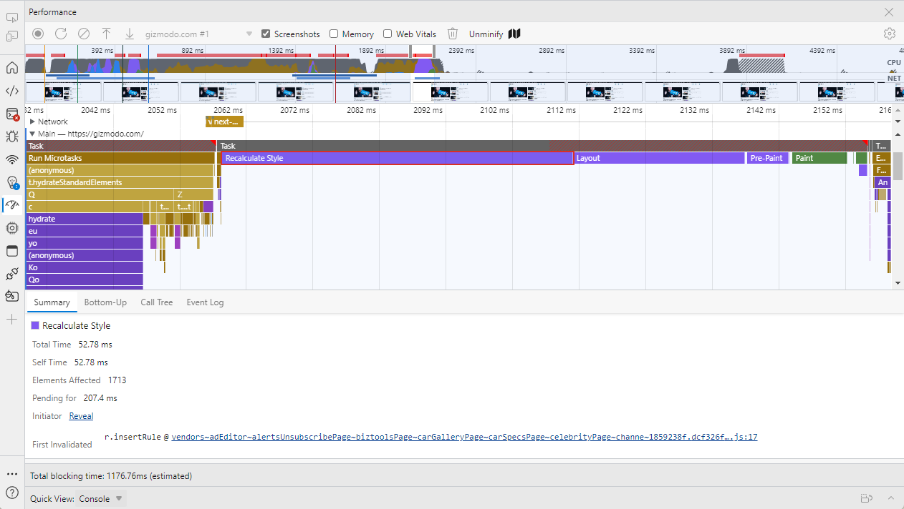
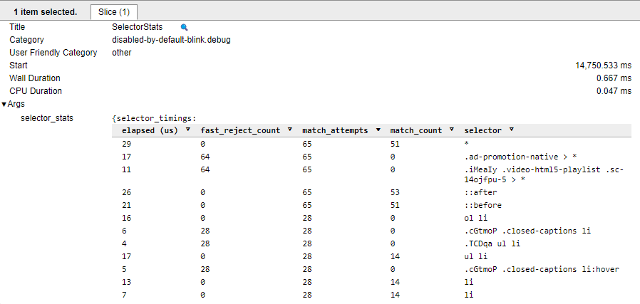
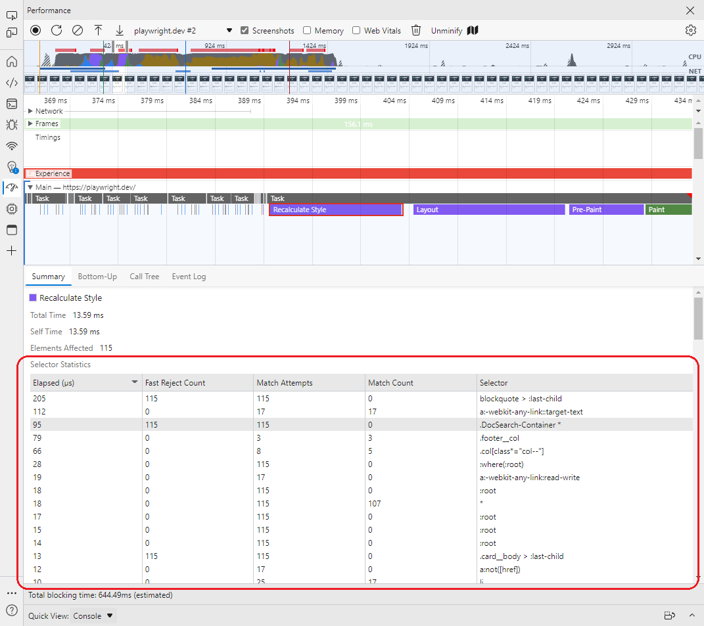
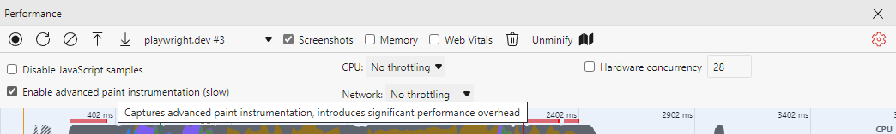

# DevTools: Selector Performance Tracing for Style Calculations

Authors:
 - *[Brandon Walderman](https://github.com/bwalderman)*, Senior Software Engineer, Microsoft Edge

## Status of this feature

This is a proposal for a new feature that is not yet in development.

## Introduction

Style recalculation is the process of iterating through DOM elements on a page, finding all of the CSS style rules that match a given element and then computing the element's actual style based on these rules.
Style recalc needs to happen whenever the applicability of CSS rules may have changed. Some examples include:

- Elements were inserted or removed from the DOM
- An element's attributes (e.g. class, id) were changed
- User input such as mouse move or focus change, which can affect `:hover` rules

Style recalc can be an expensive operation and long-running style or layout operations can become performance bottlenecks that web developers need to debug.

The DevTools performance panel records a "Recalculate Style" trace event that shows when style recalculation occurs.

The event currently shows the elapsed time and total number of elements affected, but no information about which elements these are, or which style rules were involved.
Although the JavaScript location that triggered the style recalc is sometimes included in the trace event, it may not always be obvious how the initiator is related to the affected elements, especially when there are a large number of them.
Overall, this can make it difficult for web developers to understand how to fix long-running style recalc tasks with the information at hand.

We'd like to offer web developers greater visibility into how time is being spent during style recalc to make it easier to root cause and mitigate performance issues due to recalc.

## Existing Solutions

Developers can already see extra statistics from style recalc in the `edge://tracing` UI if the `"blink.debug"` tracing tag is enabled.
The statistics show up as a `SelectorStats` trace event which includes a table of style rules with the following columns:

- Elapsed CPU time spent evaluating the style rule (lower is better)
- Number of "fast reject" elements that were cheap/efficient to eliminate from matching (higher portion of attempts is better)
- Number of elements the Blink rendering engine attempted to match with the rule
- Number of elements that were actually matched
- CSS selector text

## Proposed Solution

This information can be valuable to web developers, but the `edge://tracing` UI can be daunting, especially for beginners.
The proposed solution is to display these same statistics in the details view for "Recalcuate Style" events in DevTools performance traces, where it will be more visible to web developers who are already familiar with the DevTools performance panel.

Developers will be able to sort the table by any column, so that they can identify individual rules that take a longer time to process or have a high number of match attempts.
If available, the CSS selector text will be enhanced with a link to the source location where the CSS rule is declared. This will let web developers quickly jump to the rule they are interested in so they can continue their investigation.

Below is a mockup of the proposed design, with the new content  highlighted in red. Note that links to source locations are not currently shown in this mockup but would be rendered similar to other source links found in DevTools.

## Usage

Selector statistics in DevTools performance traces will be disabled by default because the underlying `SelectorStats` trace event is expensive to record and can have a noticeable impact on page perf.
While enabling this feature would impact raw timings captured throughout the trace, the timings would still be proportional to each other and can still yield useful information to developers.
Developers will need to explicitly enable the feature through a checkbox in the performance panel settings.

The DevTools performance panel already has a similar optional feature named "advanced paint instrumentation".
The checkbox to enable the feature includes a warning about the performance overhead, both in the label and in the tooltip.
The settings icon color is also changed to red to remind the user, even while the settings are hidden.

Instead of adding another checkbox to the settings view, we should consider merging the selector statistics and advanced paint instrumentation into a single checkbox named "enable advanced rendering instrumentation (slow)".
This avoids the need for another checkbox in the settings view and allows us to re-use the existing UI for warning about the performance impact.

When the checkbox is enabled, a table of selector statistics will be available in the details view for any "Recalculate Styles" events.

## Future Work

We should provide web developers with resources to understand how to use this new tool effectively. Some patterns in the data worth exploring:

- Expensive unused selectors
- Expensive broadly scoped selectors
- Underutilized selectors (low match count / match attempts)

## Feedback

TODO

## References

1. https://web.dev/reduce-the-scope-and-complexity-of-style-calculations
1. https://chromium-review.googlesource.com/c/chromium/src/+/3582806