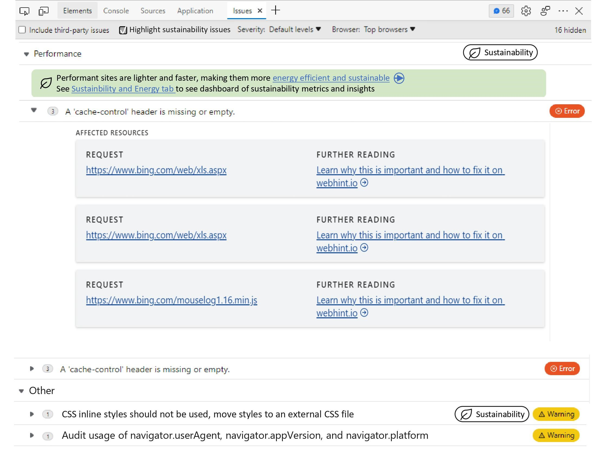

# DevTools: Feature for Sustainable Web Development 
Author:
 - [Taylore Givens](https://github.com/tayloregivens ), Program Manager Intern
## Status of this feature
This is a proposal for a new feature not yet in development. The team welcomes your feedback on this feature. Please [comment on this thread](https://github.com/MicrosoftEdge/DevTools/issues/26) to share your thoughts.
## Definition
sustainability of a web app – energy consumption of a web app
## Introduction
The carbon impact of the internet, including the hardware, software, and systems that go into creating it, produces about [3.7%]( https://www.bbc.com/future/article/20200305-why-your-internet-habits-are-not-as-clean-as-you-think) of global carbon emissions. This is similar to the percentage of global emissions from the [airline industry](https://www.bbc.com/future/article/20200305-why-your-internet-habits-are-not-as-clean-as-you-think). Developers and the public are becoming increasingly more aware and concerned about this issue. A growing number of *developers are interested in understanding what factors impact a web app's sustainability or energy consumption* and how to reduce the energy consumption. Consequently, tools such as [Website Carbon](https://www.websitecarbon.com/), [Ecograder](https://ecograder.com/), [EcoPing](https://ecoping.earth/blog/core-web-vitals-and-sustainability), and [Beacon](https://digitalbeacon.co/) have been created to calculate the amount of CO2 a web app emits and provide recommendations to improve the sustainability of a web app.
## Goals
Adding sustainability features to Edge DevTools will raise awareness about the alarming carbon impact of web apps and the internet and help developers measure and improve the sustainability of their web apps by
-	Providing proxy web app sustainability measurements
-	Highlighting common factors that reduce the sustainability of web apps by showing or explaining how these factors decrease performance and increase energy consumption
-	Indicating to developers what actions they’re currently taking, such as performance improvements, that also improve web app sustainability
-	Educating developers on new actions they can take that are purely beneficial for sustainability.
## Solution
Summary of features we’re investigating adding to DevTools:
-	Label existing issues in the Issues panel that are beneficial to sustainability and energy efficiency 
-	Create a “Sustainability” tab that provides metrics on the overall energy consumption of the web app, the impact third parties have on energy and performance, and a list of best practices to improve sustainability

### Sustainability Content Labeling in Issues Tab 

Mockup is conceptual, not the final design
#### Usage
Once the user navigates to the Issues panel, any issue or category relevant to improving sustainability will have a sustainability label. Clicking this label will expand the category or issue dropdown window. The dropdown window will include a green banner describing how the category or issue is related to sustainability. The banner will also include a link to external documentation to learn more about why the category or issue is sustainability related. The banner will potentially also include a link to the DevTools Sustainability Tab (see next section) which has a dashboard of sustainability-related metrics and insights.
Sustainability labeling will be enabled by default but can be disabled to reduce noisiness. Categories or issues labeled as sustainable would be prioritized in the ordering of categories and issues.

### Sustainability Tab
The Sustainability tab will be a hub for sustainability-related metrics and provide insight about web app energy consumption, third parties' impact on performance, and best practices to improve sustainability.

Some developers have suggested adding a website carbon calculator to DevTools, similar to the calculator on [Website Carbon](https://www.websitecarbon.com/). However, since these algorithms rely on inputting the byte size of the website and applying average ratios (i.e. kWh/byte and CO2 g/kWh) to get a carbon estimate, this methodology leaves many factors unaccounted for. Therefore, we propose displaying the carbon calculation as an estimate of carbon emitted from the *network transfer energy that goes into rendering a web app* rather than having the calculation represent the total carbon emissions associated with a web app. 

#### Content and Usage
The Sustainability tab will have three sections: Energy Consumption, Third Party Impact, and Best Practices. 

Energy Consumption

> The Client-Device Energy and Network Transfer Energy sub-sections display metrics relevant to how much energy is used to render the web app on the client device and transfer it over the network to give the developer a sense of the energy consumed by the web app. 
> Client-device energy
> -	“Client-Device Energy Score“ is out of 100 and is based on the CPU utilization and GPU utilization of the web app's initialization compared to the average web app. The score will vary slightly depending on the client's device due to different hardware. The score should be used as a guideline metric to assess how incremental code changes affect the client device energy.
> -	CPU metrics such as the average CPU utilization and the live CPU utilization  
> -	Link to Performance tab to further investigate CPU utilization
> Network Transfer energy
> -	Bytes transferred and number of network requests to give context to the amount of network activity the web app is generating
> -	Use an open-source API, such as the [Green Web Foundation API] (https://www.thegreenwebfoundation.org/green-web-feed/), to estimate carbon emissions due to the energy required to transfer bytes over the network 

Third-Party Impact
> Third parties are often incorporated or added on top of web apps without much thought as to how they affect the weight and performance of the app. We will display the following data to help developers identify the potential negative impact third parties are having on their web app. 
> -	number of requests made to third parties
> -	number of bytes transferred from these network requests/all bytes transferred
> -	time consumed by third-party requests/total load time for web app 

Best Practices
> Sustainable web app design recommendations focus on making the web app as light and high-performant as possible by limiting unnecessary web app components.
> There are certain properties we recommend eliminating or adding to a web app to improve its sustainability, such as eliminating [inline CSS Styles](https://webhint.io/docs/user-guide/hints/hint-no-inline-styles/) because inline CSS can’t be cached or switching your hosting to a [hosting service that runs on renewable energy](https://www.thegreenwebfoundation.org/).
> 
> However, for other properties that negatively impact sustainability, it's unreasonable to recommend that all web apps eliminate these properties such as [custom fonts or large photos](https://www.fastcompany.com/90605005/these-are-the-worlds-most-sustainable-fonts#:~:text=Arial%20and%20Times%20New%20Roman%20aren%E2%80%99t%20the%20only,custom-designed%20typefaces%2C%20this%20is%20slim%20pickings.%20%5BScreenshot%3A%20FormaFantasma%5D). Therefore, we will provide a table that shows the number of custom fonts, large photos, and other properties in a color-coded manner to indicate which counts are above or below average to give developers a sense of how sustainable their website is compared to other sites.

We welcome community feedback on this concept and the content proposed.
