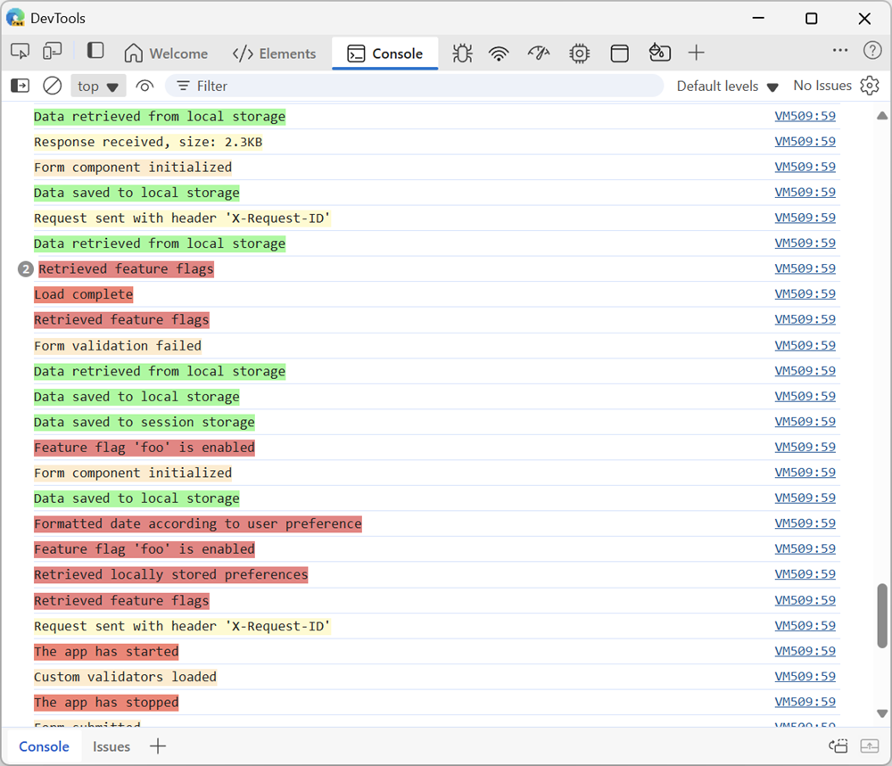

# DevTools: console.context()

Authors:
 - *[Leah Tu](https://github.com/leahmsft)*, Microsoft Edge
 - *[Patrick Brosset](https://github.com/captainbrosset)*, Microsoft Edge

## Status of this feature

An initial version of this feature has been available in Microsoft Edge starting with version 79. This explainer proposes improvements to the feature.

## Introduction

While debugging a large application, filtering through many console log messages can be challenging. If a developer wanted to group messages together, they could use console.group(), but it's possible that other unrelated logs could be included. Alternatively, they could append a group name before log messages, but this is tedious and time-consuming.

## Goals
The console.context() method provides a better solution for managing log messages. It returns a console instance that implements the console interface. Messages can be organized by logging to different contexts.

The main goals are:

1. Improve the debugging process by making it easier and faster to navigate console log messages with context-based grouping.
2. Improve the overall readability of the console.

## Use case in DevTools
Developers can create multiple named contexts for different parts of their application. By logging messages to a named context, you can easily identify and follow the flow of a specific part of your application.

In the DevTools Console panel, you can filter messages based on the name of the context. If a colour is specified for a context, the log messages will appear in that colour improving the visual clarity of messages from different contexts.

1. Create a specific logger instance for a part of your app:

`const myComponentLogger = console.context("name-of-my-component");`

2. Then log messages as normal, using your new logger:

`myComponentLogger.log("This is a log message from my component");`

`myComponentLogger.warn("This is a warning message from my component");`

3. For an even nicer experience, give your logger a color:

`myComponentLogger.log("%cThis is a log message from my component", "background-color:lemonchiffon;");`

Here is what the Console tool might look like, with the logs from all of the components of the app:

Here is what the Console tool would show, once the logs have been filtered by context, to show only the logs from one component:

